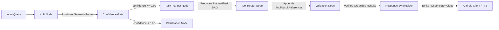

# Phase F2: Canonical Semantic Frame Specification & Architecture

**Document Version**: 1.0.0  
**Phase**: Phase F2 — Canonical Semantic Frame Foundation  
**Module**: [`backend/app/schemas/semantic_frame.py`](file:///home/rdj/FarmFusionFinal/backend/app/schemas/semantic_frame.py)  
**Status**: Implemented & Verified with 100% Passing Tests  

---

## 1. Architectural Purpose

In Phase F1, our audit established that the orchestrator passed loose, untyped Python dictionaries (`filled_slots`, `farmer_context`, `tool_output`) between nodes. This caused:
- Brittle field access and missing-key runtime exceptions.
- Inability to pass structured task plans to multi-tool pipelines.
- Accidental hallucination or default values (e.g. defaulting missing crops to "Wheat").
- Inability to communicate explicit sensor/image requirements (e.g. `LEAF_IMAGE`) to the Android frontend.

**Phase F2** establishes a strongly-typed, Pydantic v2 universal contract:
```
FARMER (Voice / Text / Image)
              ↓
   ASR / Language Detection
              ↓
  FarmerRequest / SemanticFrame
              ↓
LangGraph NLU & Confidence Gate
              ↓
    PlannedTask DAG (Planner)
              ↓
    ToolRegistry (Invocations)
              ↓
   Validation / Safety Gate
              ↓
ResponseEnvelope (Answer / Navigate / Call)
```

---

## 2. Allowed Enumerations

### 2.1 `CanonicalIntent`
Standardized cross-domain agricultural intent classification:
| Enum Value | Domain | Description |
|---|---|---|
| `weather` | Weather | Real-time weather, temperature, humidity, rain forecast |
| `smart_irrigation` | Irrigation | Root-zone soil moisture and evapotranspiration irrigation advisory |
| `irrigation_advisory` | Irrigation + Weather | Compound decision on whether to irrigate based on upcoming rain |
| `disaster_risk` | Disaster | 7-day flood, cyclone, or drought hazard alert |
| `crop_recommendation` | Crops | XGBoost (Mode A) or ICAR agronomic suitability (Mode B) crop advice |
| `disease_detection` | Disease | 38-class plant leaf pathology identification |
| `mandi_price` | Mandi | Current modal, min, max prices from Agmarknet |
| `mandi_forecast` | Mandi | Prophet + LightGBM 7-day price forecast |
| `mandi_comparison` | Mandi | Mathematical price comparison between 2+ mandis |
| `mandi_decision` | Mandi | Compound sell-now vs hold decision with spread analysis |
| `sell_hold` | Mandi | Deterministic sell or wait recommendation |
| `government_scheme` | Schemes | PM-KISAN, PMFBY, KCC eligibility and application rules |
| `agricultural_knowledge`| RAG | ICAR cultivation guides, fertilizer schedules, pest control |
| `animal_alert` | IoT | Hardware sensor intrusion alerts for wild animals |
| `general_agriculture` | General | Broad agricultural query fallback |
| `navigation_request` | Navigation | Explicit UI navigation request ("open mandi screen") |
| `repeat_last` | Voice UI | Request to repeat the previous spoken response |
| `clarification` | Safety | Triggered when query confidence is insufficient (<0.60) |
| `unsupported` | Safety | Transparent admission for out-of-scope requests (e.g. buying seeds) |

### 2.2 `CapabilityType`
Specialist engines and deterministic tools available for task composition:
- `WEATHER`, `SMART_IRRIGATION`, `DISASTER_RISK`, `CROP_RECOMMENDATION`, `DISEASE_DETECTION`, `CURRENT_PRICE`, `MANDI_HISTORY`, `MANDI_FORECAST`, `MANDI_COMPARISON`, `MANDI_DECISION`, `RAG_KNOWLEDGE`, `GOVERNMENT_SCHEME`, `ANIMAL_ALERT`, `CALLING`, `NAVIGATION`, `UNSUPPORTED`.

### 2.3 `RequiredInput`
Explicit sensor or user data missing before execution can proceed:
- `NONE`: All required inputs are present.
- `LEAF_IMAGE`: A photo of the affected plant leaf is required (gates disease detection).
- `SOIL_REPORT`: Laboratory soil test values (N, P, K, pH) are needed for Mode A XGBoost.
- `FARM_LOCATION`: GPS coordinates or district/state needed for localized forecasts.
- `CROP_NAME`: Name of the crop is missing for mandi or care queries.
- `MANDI_LOCATION`: Target market name is missing.
- `FARM_SIZE`: Acreage required for subsidy calculation.
- `OTHER`: Domain-specific unclassified slot missing.

### 2.4 `ActionIntent`
High-level decision emitted to the client:
- `ANSWER`: Direct grounded natural language answer.
- `CLARIFY`: Ask a clarifying question due to ambiguity or low confidence.
- `NAVIGATE`: Direct the client application to open a specific screen.
- `REQUEST_INPUT`: Request the user to provide an image, document, or location.
- `CALL`: Initiate an urgent telephony phone call via Vobiz.
- `NOTIFY`: Send an in-app alert or push notification.

### 2.5 `NavigationDestination` & Android Route Mapping
Fixed whitelist of valid destinations mapped to Kotlin `NavRoutes`:
```python
ANDROID_ROUTE_MAP = {
    NavigationDestination.DISEASE_SCAN: "crop_disease",
    NavigationDestination.MANDI: "mandi_prices",
    NavigationDestination.WEATHER: "weather",
    NavigationDestination.CROP_RECOMMENDATION: "crop_recommendation",
    NavigationDestination.FINANCIAL_SERVICES: "financial_services",
    NavigationDestination.DASHBOARD: "dashboard",
    NavigationDestination.ANIMAL_DETECTION: "animal_detection",
    NavigationDestination.LANGUAGE_SELECTION: "language_selection",
    NavigationDestination.BACK: "back",
}
```

---

## 3. Schema Definitions & Fields

### 3.1 `ConfidenceSet`
Granular, multi-dimensional confidence breakdown:
```python
class ConfidenceSet(BaseModel):
    language_confidence: float  # [0.0, 1.0] ASR / language ID confidence
    intent_confidence: float    # [0.0, 1.0] NLU intent match confidence
    entity_confidence: float    # [0.0, 1.0] Entity extraction accuracy confidence
    overall_confidence: float   # [0.0, 1.0] Harmonized composite confidence
```

### 3.2 `EntitySet`
Typed agricultural slot container. **Strict rule**: Unknown values remain `None` or empty. Zero fake defaults!
```python
class EntitySet(BaseModel):
    crop: Optional[str] = None
    disease: Optional[str] = None
    market: Optional[str] = None
    mandi: Optional[str] = None
    markets: List[str] = []
    village: Optional[str] = None
    city: Optional[str] = None
    district: Optional[str] = None
    state: Optional[str] = None
    farm_location: Optional[FarmLocation] = None
    timeframe: Optional[str] = None
    forecast_days: Optional[int] = None
    soil_values: Optional[SoilValues] = None
    farm_size: Optional[float] = None
    farm_size_unit: Optional[str] = "acre"
    quantity: Optional[float] = None
    quantity_unit: Optional[str] = "quintal"
    season: Optional[str] = None
    additional_entities: Dict[str, Any] = {}
```

### 3.3 `SemanticFrame`
The universal representation of a single conversational turn:
```python
class SemanticFrame(BaseModel):
    request_id: str
    session_id: str
    raw_text: str
    normalized_text: str
    language: str = "hi"
    dialect: Optional[str] = None
    intent: CanonicalIntent
    sub_intent: Optional[str] = None
    required_capabilities: List[CapabilityType] = []
    entities: EntitySet = EntitySet()
    required_input: RequiredInput = RequiredInput.NONE
    confidence: ConfidenceSet
    user_context: Optional[UserContext] = None
    conversation_context: Optional[ConversationContext] = None
    requested_output_language: str = "hi"
    timestamp: datetime
```

### 3.4 `PlannedTask` & `ToolInvocation`
Execution DAG formulated by the LangGraph planner:
```python
class ToolInvocation(BaseModel):
    invocation_id: str
    tool_name: str
    capability: CapabilityType
    inputs: Dict[str, Any] = {}
    order_index: int = 0
    is_parallel: bool = False
    depends_on: List[str] = []
    timeout_seconds: float = 10.0

class PlannedTask(BaseModel):
    plan_id: str
    request_id: str
    intent: CanonicalIntent
    tool_invocations: List[ToolInvocation] = []
    requires_clarification: bool = False
    clarification_prompt: Optional[str] = None
    requires_navigation: bool = False
    navigation_target: Optional[NavigationAction] = None
    requires_calling: bool = False
    calling_target: Optional[CallingAction] = None
    explanation: str = ""
```

### 3.5 `ResponseEnvelope`
The final payload sent to Android and synthesized as audio:
```python
class ResponseEnvelope(BaseModel):
    request_id: str
    session_id: str
    language: str
    action: ActionIntent
    response_text: str
    speech_text: Optional[str] = None
    navigation: Optional[NavigationAction] = None
    calling: Optional[CallingAction] = None
    data: Optional[Dict[str, Any]] = None
    confidence: ConfidenceSet
    provenance: List[Dict[str, Any]] = []
    follow_up_suggestions: List[str] = []
    timestamp: datetime
```

---

## 4. The 5 Core Specification Examples (Validated at Runtime)

### Example A: Mandi Price Lookup
**User Input**: *"Gehu ka mandi bhav kya hai Jaipur mein?"*
```json
{
  "request_id": "req_001",
  "session_id": "sess_101",
  "raw_text": "Gehu ka mandi bhav kya hai Jaipur mein?",
  "normalized_text": "गेहूं का मंडी भाव क्या है जयपुर में",
  "language": "hi",
  "intent": "mandi_price",
  "required_capabilities": ["CURRENT_PRICE"],
  "entities": {
    "crop": "Wheat",
    "market": "Jaipur",
    "city": "Jaipur",
    "markets": []
  },
  "required_input": "NONE",
  "confidence": {
    "language_confidence": 0.98,
    "intent_confidence": 0.95,
    "entity_confidence": 0.92,
    "overall_confidence": 0.92
  }
}
```

### Example B: Disease Query Missing Leaf Photo (Navigation Gate)
**User Input**: *"Meri gehun ki fasal mein kaunsi bimari hai?"*
```json
{
  "request_id": "req_002",
  "session_id": "sess_102",
  "raw_text": "Meri gehun ki fasal mein kaunsi bimari hai?",
  "normalized_text": "मेरी गेहूं की फसल में कौन सी बीमारी है",
  "language": "hi",
  "intent": "disease_detection",
  "required_capabilities": ["DISEASE_DETECTION", "RAG_KNOWLEDGE"],
  "entities": {
    "crop": "Wheat",
    "markets": []
  },
  "required_input": "LEAF_IMAGE",
  "confidence": {
    "language_confidence": 0.97,
    "intent_confidence": 0.94,
    "entity_confidence": 0.90,
    "overall_confidence": 0.90
  }
}
```
**Triggered Navigation Action**:
```json
{
  "action": "NAVIGATE",
  "destination": "DISEASE_SCAN",
  "android_route": "crop_disease",
  "required_input": "LEAF_IMAGE",
  "message": "कृपया प्रभावित पत्ती की तस्वीर लें या अपलोड करें।"
}
```

### Example C: Cross-Agent Irrigation Advisory
**User Input**: *"Kal barish hogi to gehun mein pani dena chahiye?"*
```json
{
  "request_id": "req_003",
  "session_id": "sess_103",
  "raw_text": "Kal barish hogi to gehun mein pani dena chahiye?",
  "normalized_text": "कल बारिश होगी तो गेहूं में पानी देना चाहिए",
  "language": "hi",
  "intent": "irrigation_advisory",
  "required_capabilities": ["WEATHER", "SMART_IRRIGATION"],
  "entities": {
    "crop": "Wheat",
    "timeframe": "tomorrow",
    "markets": []
  },
  "required_input": "NONE",
  "confidence": {
    "language_confidence": 0.96,
    "intent_confidence": 0.93,
    "entity_confidence": 0.91,
    "overall_confidence": 0.91
  }
}
```

### Example D: Multi-Market Comparison & Forecast Decision
**User Input**: *"Gehu Jaipur mein bechu ya Kalapipal aur agle 7 din ka bhav kya rahega?"*
```json
{
  "request_id": "req_004",
  "session_id": "sess_104",
  "raw_text": "Gehu Jaipur mein bechu ya Kalapipal aur agle 7 din ka bhav kya rahega?",
  "normalized_text": "गेहूं जयपुर में बेचूं या कालापीपल और अगले 7 दिन का भाव क्या रहेगा",
  "language": "hi",
  "intent": "mandi_decision",
  "required_capabilities": [
    "CURRENT_PRICE",
    "MANDI_COMPARISON",
    "MANDI_FORECAST",
    "MANDI_DECISION"
  ],
  "entities": {
    "crop": "Wheat",
    "markets": ["Jaipur", "Kalapipal"],
    "timeframe": "next 7 days",
    "forecast_days": 7
  },
  "required_input": "NONE",
  "confidence": {
    "language_confidence": 0.98,
    "intent_confidence": 0.94,
    "entity_confidence": 0.93,
    "overall_confidence": 0.93
  }
}
```

### Example E: Disaster Risk & RAG Grounding
**User Input**: *"Flood ka risk hai kya aur kya karna chahiye?"*
```json
{
  "request_id": "req_005",
  "session_id": "sess_105",
  "raw_text": "Flood ka risk hai kya aur kya karna chahiye?",
  "normalized_text": "बाढ़ का खतरा है क्या और क्या करना चाहिए",
  "language": "hi",
  "intent": "disaster_risk",
  "required_capabilities": [
    "WEATHER",
    "DISASTER_RISK",
    "RAG_KNOWLEDGE"
  ],
  "entities": {
    "timeframe": "next 7 days",
    "markets": []
  },
  "required_input": "NONE",
  "confidence": {
    "language_confidence": 0.95,
    "intent_confidence": 0.96,
    "entity_confidence": 0.88,
    "overall_confidence": 0.88
  }
}
```

---

## 5. How LangGraph Will Consume the State

In Phase F3 through F5, `OrchestratorState` will store:
- `semantic_frame: SemanticFrame` (populated by NLU node)
- `planned_task: PlannedTask` (populated by Task Planner node)
- `tool_results: List[ToolResultReference]` (populated by Tool Router)
- `response_envelope: ResponseEnvelope` (populated by Synthesizer)



This guarantees complete type safety, elimination of data fabrication, and graceful multi-agent execution.
