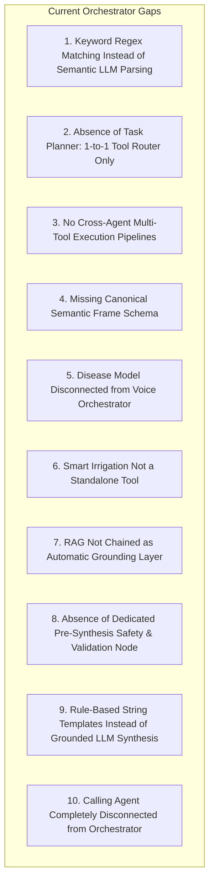

# Phase F: Central Multilingual Agent Orchestration Technical Audit

**Audit Date**: September 4, 2026  
**Auditor**: Antigravity AI  
**Scope**: Full read-only architectural and runtime audit of the Central Orchestrator (`backend/app/orchestrator/`), Tool Registry (`backend/app/tools/`), Session Memory, Multi-Tool Routing, RAG Grounding, Safety Validation, Android Navigation, and Telephony Integration.  
**Objective**: Establish runtime ground truth, identify architecture drift, classify components (REAL / PARTIAL / MOCKED / RULE-BASED / LLM-BASED / NOT IMPLEMENTED), and diagnose exact gaps preventing 10/10 central orchestration.

---

## 1. Executive Summary & Component Classification Matrix

| Subsystem / Capability | Current Runtime Status | Implementation Mechanism | Reality vs Promise |
|---|---|---|---|
| **LangGraph Topology** | **REAL** | `StateGraph(OrchestratorState)` with `MemorySaver` checkpointer in `graph.py`. 3 nodes (`intent_classification`, `tool_router`, `response_synthesizer`) + 1 conditional edge. | Graph exists and runs, but topology is a trivial 3-node linear pipeline with no iterative planning loop. |
| **Intent Classification** | **RULE-BASED** | `intent_classification.py` (447 lines of hardcoded Python `if-elif` keyword/substring matching and regexes). | **Architecture Drift**: Advertised as LLM semantic parsing, but runtime contains 0 LLM calls. Fragile against novel phrasing, complex syntax, or noisy ASR. |
| **Entity Extraction** | **RULE-BASED** | Hardcoded city lists (`city_lookup` dictionary of 18 cities), regex digits for prices/percentages, and crop lists. | Fails for unlisted towns/mandis, complex timeframes, or multi-entity compound questions. |
| **Task Planner** | **NOT IMPLEMENTED** | Direct 1:1 dictionary lookup (`tool_map` in `tool_router.py`). | Completely absent. Cannot decompose multi-step queries (e.g. "Rain tomorrow, should I irrigate wheat today?"). |
| **Tool Registry** | **REAL** | `ToolRegistry` class in `registry.py` with 16 registered tool contracts, typed `ToolResult`, `ToolStatus`, and `ProvenanceMetadata`. | Real and functional. Wraps Weather, Mandi, Crop (Mode A/B), Disaster, Soil, Animal IoT, Schemes, and RAG. |
| **Disease Detection Tool** | **PARTIAL** | Only `disease_info_tool` (text/KB lookup) is in registry. The 38-class EfficientNet-B3 model pipeline (`disease_workflow.py`) is NOT exposed as an orchestrator tool. | Broken handoff. If user asks "what disease is this?", it returns text or asks for a photo, but does not execute image diagnosis in-graph. |
| **Smart Irrigation Tool** | **PARTIAL** | `_calculate_smart_irrigation` is embedded inside `weather_agent.py` and returns advice inside `weather_tool` data, but is NOT an independent callable tool. | Cannot be invoked by a planner independently of raw weather. |
| **RAG Grounding** | **PARTIAL** | `KnowledgeRetriever` in `app/rag/retriever.py` uses pgvector HNSW cosine search. Available via `rag_search_tool`, but NOT systematically chained after specialist model results. | Grounding is passive. Specialist outputs (disease, crop, disaster) are not automatically cross-grounded in ICAR literature. |
| **Safety & Validation Node** | **NOT IMPLEMENTED** | No dedicated validation node between tool execution and response synthesis. Only safety rule #6 (clarification when confidence < 0.6) is checked. | No validation of numerical ranges, units, cross-tool contradictions, or model uncertainty tiers before answering. |
| **Response Synthesis** | **RULE-BASED** | `synthesizer.py` (544 lines of static Python template strings and f-strings). | **Zero LLM usage**. Cannot naturally explain compound multi-tool results or adapt dynamically to complex queries. |
| **Android Navigation** | **PARTIAL** | Tool returns `{"destination": "market_prices"}`. Android `VoiceAssistantScreen.kt` maps hardcoded strings (`"market_prices"`, `"crop_disease"`, `"dashboard"`). | Works for simple navigation, but orchestrator does not emit a unified canonical action frame (`NAVIGATE`, `ANSWER`, `CALL`, `CLARIFY`). |
| **Calling Agent Integration**| **NOT IMPLEMENTED** | `backend/app/calling_agent/` exists with Vobiz telephony and Groq/OpenRouter conversation logic, but has ZERO connection to LangGraph orchestrator. | Orchestrator cannot trigger an outbound voice call or escalate disaster alerts to telephony. |
| **Multi-Turn Session Memory**| **REAL** | `OrchestratorState` retains `session_id`, `farmer_context`, `last_recommendations`, `last_tool_result`, `active_crop`. Tested via MemorySaver thread IDs. | Functional for simple 2-turn anaphora ("पहली वाली क्यों?"), but lacks canonical semantic frame history and multi-turn entity accumulation. |

---

## 2. Deep Dive: 10 Architectural Audit Dimensions

### 2.1 Current LangGraph Implementation
- **File**: `backend/app/orchestrator/graph.py`
- **Structure**:
  ```
  START 
    ↓
  intent_classification_node
    ↓ (conditional: if requires_clarification -> response_synthesizer)
  tool_router_node
    ↓
  response_synthesizer_node
    ↓
  END
  ```
- **State Machine**: Built with `langgraph.graph.StateGraph(OrchestratorState)` and compiled with `langgraph.checkpoint.memory.MemorySaver()`.
- **Runtime Execution**: Invoked via `await orchestrator_graph.ainvoke(initial_state, config={"configurable": {"thread_id": session_id}})`.
- **Limitation**: It is a fixed, non-iterative 3-step pipeline. There is no supervisor loop, no replanning capability, no sub-graph invocation, and no dynamic multi-step traversal.

### 2.2 Current LLM Usage
- **Audit Finding**: **0% LLM Utilization in Central Orchestration.**
- In `backend/app/orchestrator/`:
  - `intent_classification.py`: 0 LLM calls (100% regex and substring matching).
  - `tool_router.py`: 0 LLM calls (100% dictionary key lookup).
  - `synthesizer.py`: 0 LLM calls (100% hardcoded template strings).
- **Core Principle Alignment**: While FarmFusion strictly mandates that the LLM must *never* fabricate numerical truth (mandi prices, weather numbers, crop probabilities), the architecture intended the LLM to handle **natural language understanding, semantic intent parsing, task planning, and grounded explanation synthesis**. Currently, the LLM is entirely bypassed in favor of rigid brittle keyword matching.

### 2.3 Current Tool Routing
- **File**: `backend/app/orchestrator/nodes/tool_router.py`
- **Routing Table**:
  ```python
  tool_map = {
      "weather": "weather_tool",
      "disaster_risk": "disaster_risk_tool",
      "crop_recommendation": "crop_recommendation_tool",
      "what_if": "crop_recommendation_tool",
      "disease": "disease_info_tool",
      "crop_care": "crop_care_tool",
      "mandi": "market_price_tool",
      "best_nearby_mandi": "best_nearby_mandi_tool",
      "best_practical_mandi": "best_practical_mandi_tool",
      "compare_mandi": "mandi_comparison_tool",
      "sell_wait_advisory": "mandi_advisory_tool",
      "explain_forecast": "mandi_advisory_tool",
      "price_alert": "price_alert_tool",
      "scheme": "government_scheme_tool",
      "animal_detection": "animal_detection_tool",
      "navigation": "navigation_tool",
      "unsupported_capability": "unsupported_capability_tool",
  }
  ```
- **Limitation**: Strict 1-to-1 mapping. If an intent matches `weather`, it calls *only* `weather_tool`. It cannot call `weather_tool` followed by `smart_irrigation_tool`. If a farmer asks a question spanning multiple domains, only one tool is selected; the other domain is silently dropped.

### 2.4 Current Specialist Contracts
- **File**: `backend/app/tools/registry.py`
- **Structure**: Every tool adheres to `ToolDefinition` (name, description, required_slots, optional_slots) and returns `ToolResult` with `ToolStatus` (`SUCCESS`, `UNAVAILABLE`, `INVALID_INPUT`, `NETWORK_ERROR`, `NOT_FOUND`, `REQUIRES_PHOTO`, `UNSUPPORTED_CAPABILITY`) and `ProvenanceMetadata`.
- **Specialist Backends Connected**:
  - **Weather**: Open-Meteo API via `WeatherService` (measured NWP).
  - **Crop Recommendation**: `LocalCropEngine` (Mode A: XGBoost with 22 crop classes; Mode B: ICAR Agronomic Suitability).
  - **Mandi Intelligence**: `MarketService` + `MandiPriceForecaster` (Prophet + LightGBM 60/40 ensemble trained on genuine 255k Agmarknet records).
  - **Disaster Hazard**: `disaster_risk_tool` executing 4-model ensemble (XGBoost + LightGBM + CatBoost + Random Forest).
  - **Soil Grids**: ISRIC SoilGrids API.
  - **IoT Animal Detection**: Hardware Node sensor database query.
- **Contract Gaps**:
  - Missing standalone `smart_irrigation_tool`.
  - Missing `disease_detection_tool` (38-class EfficientNet-B3 inference with image bytes).
  - Missing `calling_tool` (Vobiz telephony trigger).

### 2.5 Current Navigation Capability
- **Backend**: `navigation_tool` in `registry.py` validates destination against:
  `["market_prices", "mandi", "weather", "crop_recommendation", "crop_disease", "disease_detection", "financial_services", "government_schemes", "home", "dashboard", "back"]`.
- **API Mapping**: In `app/api/v1/voice.py`, maps `intent == "navigation"` to `action = "navigate"`, and `intent == "disease"` to `action = "open_camera"`.
- **Frontend**: Kotlin Android app in `VoiceAssistantScreen.kt` maps `"navigate"` and `"open_camera"` to `NavController` destinations (`"mandi_prices"`, `"weather"`, `"crop_recommendation"`, `"crop_disease"`, `"financial_services"`, `"dashboard"`).
- **Limitation**: The orchestrator does not emit a unified canonical action frame (`action`, `destination`, `required_input`, `message`). When disease queries arrive without an image, the orchestrator returns text rather than a structured `NAVIGATE -> DISEASE_SCAN` action envelope.

### 2.6 Current RAG Integration
- **Backend Components**:
  - `app/rag/embedder.py`: BGE-M3 1024-dimensional dense embedder.
  - `app/rag/retriever.py`: `KnowledgeRetriever` with PostgreSQL pgvector cosine distance search (`<=>`) on HNSW index.
  - Ingestion dataset: 174+ ICAR crop guides, disease management protocols, and government scheme documents.
- **Current Runtime Usage**:
  - Invoked *only* when `rag_search_tool` or `government_scheme_tool` is directly routed.
  - **Critical Gap**: RAG is not integrated as an automatic post-prediction grounding layer for disease diagnosis, crop selection, or disaster mitigation.

### 2.7 Current Memory & Session Behavior
- **State Store**: In-memory `MemorySaver` checkpointer in LangGraph keyed by `session_id`.
- **Working Turn History**: Retains `farmer_context` (location, soil), `last_recommendations` (crop list), `active_crop`, `last_tool_result`.
- **Limitation**:
  - Does not maintain a canonical slot-accumulation frame across arbitrary conversational turns.
  - If a farmer gives information in pieces (Turn 1: "Wheat price", Turn 2: "In Jaipur", Turn 3: "For 7 days"), slot merging is done ad-hoc rather than through a structured slot state machine.

### 2.8 Current Multilingual Behavior
- **Supported Languages**: Bhashini Tier 1 (Hindi, English, Bengali, Gujarati, Marathi, Punjabi, Tamil, Telugu, Kannada, Malayalam) + regional dialects (Marwari, Mewari).
- **Dialect Handling**: `app/voice/languages.py` detects dialect markers (e.g. `khamma ghani`, `su kare chho`). If Mewari/Marwari is detected, `synthesizer.py` uses pre-written Marwari text templates, but flags `fallback_used = True` for TTS (using Hindi voice since no native Marwari TTS exists).
- **Limitation**: Synthesized text in non-Hindi languages relies on a small set of static dictionary translations; dynamic agricultural explanations cannot be generated in regional languages without LLM synthesis.

### 2.9 Current Failure Handling & Safety Rules
- **Safety Rule #1 (Weather)**: Adhered to (Open-Meteo physical NWP used; no LLM arithmetic).
- **Safety Rule #2 (Mandi)**: Adhered to (Prophet + LightGBM ML model produces numbers; zero LLM arithmetic).
- **Safety Rule #3 (Disease Tier)**: Adhered to in `disease_workflow.py` (`high`, `medium`, `low`, `unclear`), but NOT connected to the main orchestrator.
- **Safety Rule #4 (Schemes)**: Adhered to (RAG lookup only).
- **Safety Rule #5 (Navigation Whitelist)**: Hardcoded whitelist enforced.
- **Safety Rule #6 (Confidence Gate)**: Partially implemented. If `confidence < 0.6`, it returns a generic clarification question. However, `confidence` is currently hardcoded as `0.94` or `0.95` across regex blocks, making the gate effectively dead code!

---

## 3. The 10 Exact Gaps Preventing 10/10 Orchestration



1. **Brittle Rule-Based Intent Classification**:
   Currently uses 447 lines of keyword string searches. Minor typographical errors, colloquial rural phrasing, and code-switched Indian languages easily fail or misclassify. Must be replaced with LLM semantic parsing with a deterministic fallback.

2. **Absence of a Task Planner**:
   Currently, `intent -> single_tool`. Complex questions like *"Should I irrigate wheat if rain is expected tomorrow?"* cannot be answered because the system cannot formulate a multi-step plan.

3. **No Cross-Agent Execution**:
   Specialists operate as isolated silos. There is no mechanism to combine Weather + Irrigation, Disease + Weather + RAG, or Mandi Current + Forecast + Comparison in a single turn.

4. **Lack of Canonical Semantic Frame**:
   State passes loose dictionary slots (`filled_slots`) without typed Pydantic validation for requests, entity bounds, required inputs, and per-entity confidence.

5. **Disease Image Handoff Disconnection**:
   The 38-class EfficientNet-B3 model lives in `disease_workflow.py`, but the voice agent only knows `disease_info_tool` (text). Asking about disease without an image fails to emit an explicit `NAVIGATE -> DISEASE_SCAN` action envelope.

6. **Smart Irrigation Embedded in Weather**:
   Agronomic soil moisture intelligence exists in `weather_agent.py`, but cannot be independently called by an orchestrator planning node.

7. **Passive RAG Grounding**:
   RAG is only executed if the user explicitly asks for a knowledge document. It is not automatically injected to ground disease treatments, crop recommendations, or disaster mitigations.

8. **Missing Validation & Safety Node**:
   No node validates tool results before synthesis. Contradictions, low model confidence tiers, and unit mismatches pass through unchecked.

9. **Static Response Synthesizer**:
   Responses are assembled via rigid Python string concatenation. Farmers asking nuanced multi-part questions receive canned, robotic text.

10. **Disconnected Telephony Calling Agent**:
    The Vobiz-powered Calling Agent in `app/calling_agent/` cannot be triggered by the central orchestrator when critical disaster alerts or urgent farmer escalations occur.

---

## 4. Architectural Target State (Phase F Roadmap)

```
                       FARMER QUERY (Voice / Text / Image)
                                      ↓
                         Language & Dialect Detection
                                      ↓
                        Canonical Semantic Frame Node
                                      ↓
                     LLM Intent & Entity Extraction Node
                                      ↓
                              Confidence Gate
                       (Strict Per-Domain Thresholds)
                                      ↓
                         Dynamic Task Planner Node
                   (Multi-step sequential & parallel DAG)
                                      ↓
                        Unified Tool Registry Layer
             ┌─────────────┬─────────────┬─────────────┬─────────────┐
             ↓             ↓             ↓             ↓             ↓
          Weather     Irrigation       Crop         Disease        Mandi
         (Open-Meteo) (Agronomic)    (XGBoost)  (EfficientNet) (Prophet+LGBM)
             └─────────────┴─────────────┴─────────────┴─────────────┘
                                      ↓
                            RAG Grounding Layer
                           (pgvector + BGE-M3)
                                      ↓
                          Validation & Safety Node
                   (Unit, Range, Tier, & Consistency Check)
                                      ↓
                           Action Decision Engine
                    ┌─────────────────┼─────────────────┐
                    ↓                 ↓                 ↓
                 ANSWER            NAVIGATE            CALL
             (Grounded LLM)     (Android Screen)     (Vobiz)
```

---

## 5. Audit Sign-Off & Recommendation

- **Audit Completion**: All 10 architectural areas inspected at code level.
- **Zero Code Modification**: No application code was altered during this audit.
- **Recommendation**: Proceed to **Phase F2 (Canonical Semantic Frame)** to define the strongly-typed Pydantic state representations that replace ad-hoc dictionary passing.
