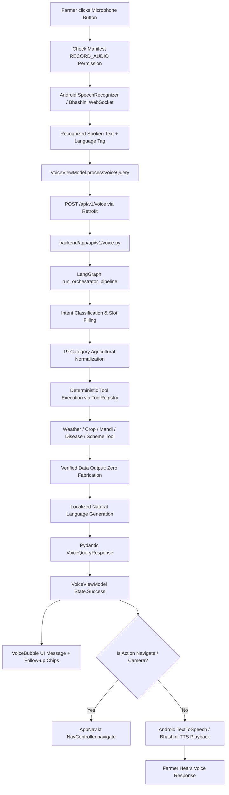

# FarmFusion Voice Assistant UI & Frontend Integration Audit

## 1. Frontend & Android Voice Architecture Overview

- **UI Screen**: [`frontend/app/src/main/java/com/example/farmfusionapp/ui/screens/VoiceAssistantScreen.kt`](file:///home/rdj/FarmFusionFinal/frontend/app/src/main/java/com/example/farmfusionapp/ui/screens/VoiceAssistantScreen.kt)
- **ViewModel**: [`frontend/app/src/main/java/com/example/farmfusionapp/viewmodel/VoiceViewModel.kt`](file:///home/rdj/FarmFusionFinal/frontend/app/src/main/java/com/example/farmfusionapp/viewmodel/VoiceViewModel.kt)
- **Retrofit API Client**: [`frontend/app/src/main/java/com/example/farmfusionapp/network/FarmFusionApi.kt`](file:///home/rdj/FarmFusionFinal/frontend/app/src/main/java/com/example/farmfusionapp/network/FarmFusionApi.kt)
- **Data Models**: [`frontend/app/src/main/java/com/example/farmfusionapp/data/model/ApiModels.kt`](file:///home/rdj/FarmFusionFinal/frontend/app/src/main/java/com/example/farmfusionapp/data/model/ApiModels.kt)
- **TTS Helper**: [`frontend/app/src/main/java/com/example/farmfusionapp/utils/VoiceTtsHelper.kt`](file:///home/rdj/FarmFusionFinal/frontend/app/src/main/java/com/example/farmfusionapp/utils/VoiceTtsHelper.kt)
- **App Navigation**: [`frontend/app/src/main/java/com/example/farmfusionapp/ui/screens/AppNav.kt`](file:///home/rdj/FarmFusionFinal/frontend/app/src/main/java/com/example/farmfusionapp/ui/screens/AppNav.kt)

---

## 2. Complete End-to-End Voice Pipeline

---

## 3. UI State Machine & Transitions

1. **`IDLE`**: Ready for input. Hero mic button pulses gently with current language indicator.
2. **`LISTENING`**: Microphone active (`RECORD_AUDIO` permission verified). Red recording indicator and sound wave animation displayed.
3. **`PROCESSING`**: Speech recognized. Query added to conversation history; loading spinner appears.
4. **`THINKING / TOOL EXECUTION`**: LangGraph orchestrator processes entities and queries live weather/mandi/crop tools.
5. **`RESPONDING`**: Structured payload returned. Verified message displayed with suggestion chips.
6. **`SPEAKING`**: TextToSpeech reads back response in farmer's language. Mic is gated to prevent recording own TTS audio.
7. **`ERROR / RETRY`**: Network or recognition errors surface friendly toast and allow instant one-tap retry.

---

## 4. API Contract Alignment

| Client Field (`ApiModels.kt`) | Backend Field (`models/voice.py`) | Type | Status |
|---|---|---|---|
| `query` | `query` | `String` / `str` | **ALIGNED** |
| `location` | `location` | `String?` / `Optional[str]` | **ALIGNED** |
| `latitude` | `latitude` | `Double?` / `Optional[float]` | **ALIGNED** |
| `longitude` | `longitude` | `Double?` / `Optional[float]` | **ALIGNED** |
| `language_hint` | `language_hint` | `String?` / `Optional[str]` | **ALIGNED** |
| `intent` | `intent` | `String` / `str` | **ALIGNED** |
| `action` | `action` | `String` / `str` | **ALIGNED** |
| `response` | `response` | `String` / `str` | **ALIGNED** |
| `data` | `data` | `Map<String, Any>?` / `Optional[Dict]`| **ALIGNED** |
| `detected_language` | `detected_language` | `String` / `str` | **ALIGNED** |
| `confidence` | `confidence` | `Double` / `float` | **ALIGNED** |
| `follow_up_suggestions` | `follow_up_suggestions` | `List<String>?` / `Optional[List[str]]`| **ALIGNED** |
| `timestamp` | `timestamp` | `String` / `str` | **ALIGNED** |

---

## 5. In-App Navigation Actions Handled

- `market_prices` / `mandi` $\to$ `navController.navigate(NavRoutes.MandiPrices)`
- `weather` $\to$ `navController.navigate(NavRoutes.Weather)`
- `crop_recommendation` $\to$ `navController.navigate(NavRoutes.CropRecommendation)`
- `disease_detection` / `crop_disease` $\to$ `navController.navigate(NavRoutes.CropDisease)`
- `government_schemes` / `financial_services` $\to$ `navController.navigate(NavRoutes.FinancialServices)`
- `home` / `dashboard` $\to$ `navController.navigate(NavRoutes.Dashboard)`
- `back` $\to$ `navController.popBackStack()`
